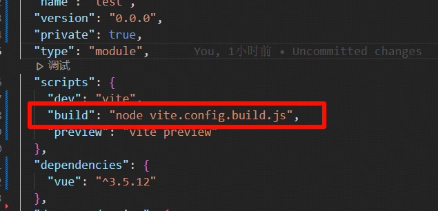
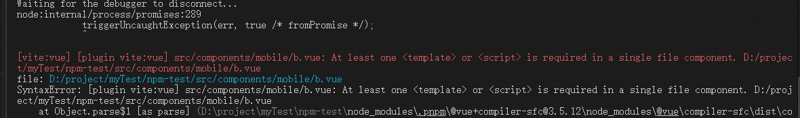
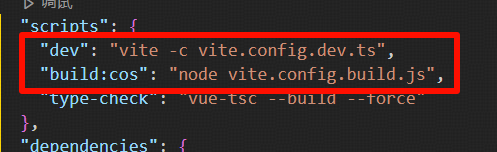
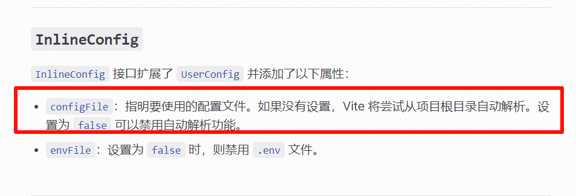

# 23.10.9
## 问题描述
遇到一个很奇怪的问题，就是在使用codemirror组件的时候，由于是复用俊哥之前的组件，按理来说，只需传入显示的值，应该就可以正常显示了。但是最后发现并不能正常显示，在我电脑上是codemirror内部报错，而俊哥电脑上是可以正常显示的，之后又让兵哥试着访问了一下，也是正常的。
刚开始以为是苹果系统和Windows系统的问题，后面俊哥提议将pnpm版本升级到8.8+，然后删除node_modules文件夹并重新安装依赖，页面居然可以正常显示了。
## 总结
遇到一台电脑无法显示，而其他电脑可以正常显示的情况，基本可以排除是代码问题。同时，对于第三方库，一般不会因为系统的不同而导致差异，因为node环境对于操作系统是无差别的。
这种情况，可以从版本差异排除。可以沿着：第三方库版本 --> node版本 --> pnmp/npm版本

# 23.10.19
实时的任务快完成了，在做实是任务的过程中给我最大的感触就是别畏首畏尾的，做了就知道了。何出此言呢？刚开始的时候，和同事对实时的需求，发现不仅他们自己内部设想没对齐，同时这位同事也没有很好的表达清楚，导致我当时是非常的迷茫，没有清晰的知道哪些该做？哪些不该做。索性决定先做着看。在做的过程中，对要做的东西越来越清晰，越来越清晰自己要完成的工作有哪些了。
所以在做项目的时候，有的时候也别太纠结一定要完全搞明白要做什么内容，然后才开工，只要对项目的需要有大约80~90%的认识，就可以动工了，毕竟项目本身就是渐进明细的。

# 23.10.31
今天遇到一个问题，就是有一个接口，需要传递一个参数对象，对象中有一个数组，并且这个参数最终会被拼接到URL中，出现的现象就是这个数组拼接的格式出现问题。刚开始自己排查，排查到最原始的一步，发现代码只是调用了axios内部的方法，没有什么问题，中途也没有对参数做任何处理。一时之间，没有了排查的方向。所以只能想组长寻求帮助，组长最初的排查方向和路线和我一样，并且最后追查到了这个地方。这时，他想到会不会是在拦截器中做了处理，一看，果然是拦截器中对参数对象使用了qs.stringify方法。
这件事给我的启示有两点：
* 凡事必有原因，且90%的可能在于代码中
* 再多想一层，答案可能就出来了

# 23.11.1
遇到初始依赖安装不起来的，首先考虑是不是node版本的问题

# 23.11.8
今天遇到一个需求，大体效果是，点击按钮，然后滚动到某个指定的位置。当然，之前在海康也遇到过类似的需求，基本是通过锚点的方式实现。但是这次还是比较坎坷，使用的是element-plus中的组件实现的，这倒无所谓，反正也是实现的方式不同而已，其实质还是锚点。在这想说的是，其实遇到一个需求不知道如何实现是很正常的一件事，重要的是要通过Google搜索，chatGpt，csdn等方式找到实现的方案。这个过程可能会花费些许时间，而且也会比较坎坷，比较痛苦，但是，这个过程确实锻炼很大。也会后面遇到这个问题，我还是记不得如何实现，但是那又如何，我知道大体方案以及如何寻找实现方案就足够应付了。而且我也经常看到江哥、兵哥查网上的资料，说明开发中大家经常会遇到一些不知道如何解决的难题，但是他们会通过查自己让自己具备解决问题的能力，我想，这才是一个项目所能带给我们的东西吧。

# 23.12.7
今天下班的路上忽然有感。以前在海康的时候，下班骑着小电驴走在天桥上的时候，心里每每都会有一种感激和庆幸的感觉。感激自己能有一份工作，每个月可以领一点薪水，和那些被裁掉的同事相比，自己无疑是非常幸运的，同时也庆幸自己没有被优化。但是来到小鹅通，走在路上心里的感觉却并不是感激和庆幸之情，更多的是充实，感觉今天又有了一些进步，又学习到了一点新东西。的确，在小鹅通大部分时候都需要加班，没有之前那么多的时间学习别的东西，反而更加充实了。
我想这种充实感主要来源于两方面：
1、在小鹅通做项目的过程中，会不自觉的接触到一些新的技术和知识点，而且这些东西都要马上用到项目开发中，这就促使我必须以最快的速度了解并使用它，而且这种方式给我的充实感比自己单纯的学习更加实在，由于会使用到，因此它从遥不可及变为了触手可得的东西了。
2、自己学习的热情从未熄灭，对前端知识的学习态度从而改变。或许是意识到自己有太多的不懂，能力太差了，所以才会一直逼着自己不断的学习。而且还会在项目开发中记录自己不懂或那些以为掌握了却是一知半解的知识，然后利用晚上的时间攻克它。
对于以后学习的内容也是有了大致了方向：优先学习一些项目中可能要用到的技术，然后尽可能的用到项目当中，学有余力再去学习一些比较流行的技术。   

# 23.12.11
今天有点小成就感，原因在于自己通过gihtub上搜索关键字，然后找到了一个满足项目功能点的第三方库。这是第一次，在完全不知道第三方库的名称也没有接触过这个库，仅凭关键字搜索然后进入官网学习，并在项目中运用，我觉得这是值得记录的一天。在此之前，我可能会优先考虑自己使用js实现，或者通过Google搜索，一般不会往第三方库想，这种做法的问题在于重复造轮子，耗时费力且成效不佳。这次的经历让我更加有了信息，以后有一些功能自己实现起来比较复杂的，完全可以上GitHub上搜索第三方库。

# 23.12.14
今天是充实的一天，没有新的任务，纯粹是对自己这个项目中之前写的代码进行优化。虽然说并没有写新的代码，但是优化自己的代码反而感激成就感贼高。记得前几天看到一位大佬写的帖子，帖子的里面讲到：实现一个功能并不难，所获得的成就感也不是很强，难的是把功能实现的同时，代码写的优雅且易于扩展，此时所获得的成就感是前者无法比拟的。这就要求在写代码的同时要多思考，而且是从全局的角度去考虑代码。显然，目前的我还无法做到。不过在小鹅通，很庆幸我有很多这样的机会来审视自己的代码，不断的优化自我的代码，而且在写代码的时候，也会尝试着思考，如何能让自己的代码更优雅。真的越来越喜欢小鹅通了，感谢老婆当时对我的建议，让我与小鹅通相遇。

# 24.01.23
最近时候有一种感觉，就是感觉自己是一个只顾着抛出问题的人，或者说只能想到解决问题的第一层，而不会深入的去挖掘问题的根源。很容易就会傻眼，不知道下一步如何排查问题来源。这方面的能力确实需要有待加强。步入社会已经好几年了，确实技术有所长进，但是技术是无穷的，唯有持续发现问题，解决问题才能不断的发展。

# 24.02.19
前面做了AI助理接入企微群的项目，暴露出许多的问题：
* 评审前不看prd，评审的时候一头雾水，对业务不了解
* 评审后不细看ui稿，ux稿，后期开发时容易出现问题
* 评审开发时长时，未考虑缓冲时间及联调时间
* 开发时，边联调边开发，严重拖慢开发进度
* 开发的时候完全照搬ui稿，和产品思路，没有发挥主观能动性
* 开发时，使用element plus组件，样式未适配sense组件

针对以上问题，以后要注意执行以下几点：

* 评审前仔细阅读prd，了解业务，有什么问题可以在评审时提出
* 开发前大致查看ui、ux稿，有什么疑问，及时反馈
* 提供开发时长时，需要留有缓冲时间
* 先使用mock数据开发，完成开发后再统一联调
* 开发过程中大胆提出自己的观点，对于一些需求可以和产品商量是否有必要开发，或者是否可以换一种更易于实现的方式来完成相同效果
* 使用element plus开发时，需要适当调整样式，适配sense组件

# 24.02.26
最近接了个项目，项目本身不难，但是领导让我用monorepo将代码移植到我们这边，他直接建了一个仓库，然后让我从零搭建。这对我来说无疑是一个比较具有挑战性的任务。毕竟在这之前，我连monorepo是什么？能够解决什么问题都不知道，更别说构建monorepo项目了。

但是我并没有立即和领导说我没有做过，或者立即询问它什么是monorepo。这一点是一个很大的进步，这说明我的学生思维正在蜕变为职场思维。尽管我对monorepo一窍不通，但是我心中有了自己的计划：
1、首先花一上午的时间搞明白几个问题：什么是monorepo？它能解决什么问题(至关重要)？如何使用monorepo？
2、如果可以搞懂，那就自己搞明白上面的问题，如果不能，再和领导讨论monorepo如何实现的问题，但是此时，经过一上午的摸索，我对monorepo肯定也有了一定的了解，也肯定可以听明白领导的解答。

然而事实上，当我了解到monorepo的时候，我才发现他居然是一个这么简单的东西。我内心不禁暗喜，幸好当时没有立马就问领导，现在看来如果当时就立即询问，那么问出的问题该是多么的愚蠢。不过，在使用monorepo的过程中，还是会遇到一些挑战，但都一一解决了，目前就剩下如何使用monorepo同时构建vue2和vue3的项目？这个问题还在解决中。

# 24.03.13
昨天的时候，在开发引入ai助理下拉框微组件的时候碰到一个问题，就是有的时候找不到挂载的节点，但是控制台一直也没有报错，所以排查了很久才发现问题的来源。其实发现了问题的来源就好解决了，解决的过程也是很简单，这就没必要阐述了。重要的是，当时看了一下微组件的源码，发现源码内部是有针对这个问题进行判别并抛出错误的，但是控制台却始终没有捕获到错误。起初也没太在意，回来一想才发现可能是我自己的原因，我在加载微组件的时候采用的是`async……await`方式，但是却没有使用`try……catch`包裹，所以即使源码内部抛出错误，由于外部并没有捕获，因此才导致控制台没有提示。所以以后使用`async……await`的时候，都应该使用`try……catch`包裹。

# 24.04.15
有一个管理台行业标签的业务，业务场景是这样的，用户点击主营行业的按钮，然后弹出一个弹窗供用户选择他的主营行业，其中按钮是我负责的，而弹窗是由基础业务中心负责的。整个场景都是比较简单的，对于基础中心的开发而言，他们需要提供一个组件给我，并且暴露相关的api，于我而言，就更简单了，只需监听用户点击事件，然后调用api即可。

开发过程中遇到的一个困惑的点是，当我接入基础提供的组件时，控制台抛出一个异常，具体问题是访问了某个不存在的变量中的属性或方法，也就是说有个变量未定义。那么发现这个问题的首先第一步，肯定就是找到弹窗的开发人员，让他确认下，代码是否有问题。后面发现他的代码并没有问题，因为在其他的一个地方也有使用他们的组件，而且是可以正常工作的。
那其实当时我还是挺疑惑的，因为我就是简单的一个按钮，然后点击调用api。后面通过打断点，然后在控制台通过调用栈去追踪到底是哪个地方调用了未声明的变量。后面发现问题的抛出在是vue内部，并且那个方法是vue实例上的，也就是说vue没有被定义。

然后又是和同事一起排查，什么原因导致的，最终我们发现是window上面没有挂载vue的原因。就是我们公司各个中心负责的模块不一样，然后各个模块可能又嵌套了其他中心的业务，所有各个中心很多时候都会提供组件给其他中心的同事使用，确保业务是在自己中心的。然后我们提供的方式通常有两种，一种是npm包，另外一种的就是微组件。通常我们优先都是选择提供微组件的，这样后期维护的话就不需要到引入的那个地方去改版本号。我们这次用的就是微组件。而我们的微组件是打包成一个umd的格式，然后我们公司之前同事开发了一个微组件的接入器，我看过他们的源码，本质就是通过系统名、微组件名和版本号，获取到cdn地址，然后创建script标签，并且把cdn地址赋值给script标签的src
那么开发弹窗组件的时候减小包的体积，在打包的时候通过配置vite.config.js中的`build.rollupOptions.external`属性把vue当作外部依赖没有打进构建包，并且配置了`build.rollupOptions.output.globals`，从全局中获取Vue的变量。本身这样配置是没有关系的，但是其实我们数据中心的系统为了兼容vue2和vue3两种微组件，所以我们在全局挂载的变量名vue指代的是vue2版本，而变量名vue3指代的是vue3版本。本次的微组件是通过vue3开发的，而在引入的时候却找的是vue2的实例，所以导致了报错，解决方案就是将`build.rollupOptions.output.globals`中vue的值指定为vue3。
但是后面他们又找过来说，需要同时支持vue2和vue3。由于vue2和vue3对于单文件组件sfc中模板的解析是有区别的，所以是无法直接复用的，遇到这种情况最好的方案就是初期使用vue-demi库开发，但是因为我们之前只考虑到在vue3中使用，现在如果使用vue-demi改写的话，开发工作量会比较大。我们我是通过在原先暴露的实例上添加一个挂载的方法，让业务侧调用这个方法并传入一个元素，然后，我内部通过调用mount方法把这个实例挂载到传入的元素上。

# 24.10.18
昨天有一个需求，要求通过vite打包一个能够按需引入的组件，起初以为很简单，只要创建一个`vite.config.build.js`文件，然后变量入口执行build函数，最后在`package.json`中配置：

但是事实却远非如此，打包的时候一直报错，错误是从`vitejs/plugin-vue`中抛出的，具体如下：

从图上可以知道，这个plugin在解析的时候要求`.vue`文件中必须有一个`template`标签和`script`标签，但显然我的`.vue`文件中是有的，所以搞了好久，也拉起江哥找了好久的问题，一直搞到下午，江哥突然说：只要去掉那个`vitejs/plugin-vue`就可以了。不过这样虽然可以打包，但显然不是最终方案，后面江哥不知道如何发现，手动执行build函数居然会执行`vite.config.js`中的内容。

后面的解决方案就是：将原先的`vite.config.js`改名为`vite.config.dev.js`，然后在`package.json`中配置：

但是，好奇的我第二天决定深入研究一下，为什么会这样，于是写了个demo，然后在vscode中断点研究，终于让我发现了原因：

1、vite在执行build（无论是脚本中的vite build还是手动执行build函数）的时候，都是会自动解析配置文件中的配置，而这个配置文件默认就是根目录下的`vite.config.js`

2、vite也提供了禁用自动解析功能的功能，那就是在手动执行`build`函数的时候传入一个参数` configFile: false `，具体作用如下：

从这件事情有如下感悟：
1、遇到不会的问题，容易把控不住心态，心态不稳，步伐就会乱

2、遇到不会的问题，不会换个角度尝试，比如江哥就能通过不断的尝试发现会自动解析`vite.config.js`文件，而我却只会按照固有思维一遍一遍的跑脚本，不会跳出思维圈取看待问题。

3、值得表扬的是，我并没有满足于问题的解决，而是继续研究，直到找到真正的原因，并找到最终解决方案

# 24.11.14
最近出的事故比较频繁，从这几次事故中窥见了自己几个致命的弱点：
1、容易控制不了自己的情绪，传播消极情绪，过多的不经意间放大宣传自己的不易，其实大可不必，面对问题时，应当以一种积极的态度对待，多说：问题不大，少传播消极情绪

2、很多事情没有竭尽全力，全力以赴的去做，而总是尽力而为，导致最终的效果都是不尽人意。这是最大的毛病，也是非常致命的。上季度时，组长已经点出了我的这个问题，当时也只是意识到自己确实存在这个问题，但却没有意识到这个问题的严重性。经此事件，突然醒悟，原来我身上存在这么一个致命的问题，如不改正，终将不堪大用。

3、操作信息不同步，解决问题也好，沟通也好，收到反馈也好，操作其他的也好，应当及时在项目群中同步，这样不仅能够及时得到反馈，也能让其他同事知道你正在做什么，更重要的是，让领导知道你正在做什么，这样领导才能及时了解项目进度，才能及时给予你帮助，上传下达，这也是需要弥补的。

4、任何改动都需要测试过才上现网，一定要保障现网逻辑的稳定性，不定不能把问题带到现网。

